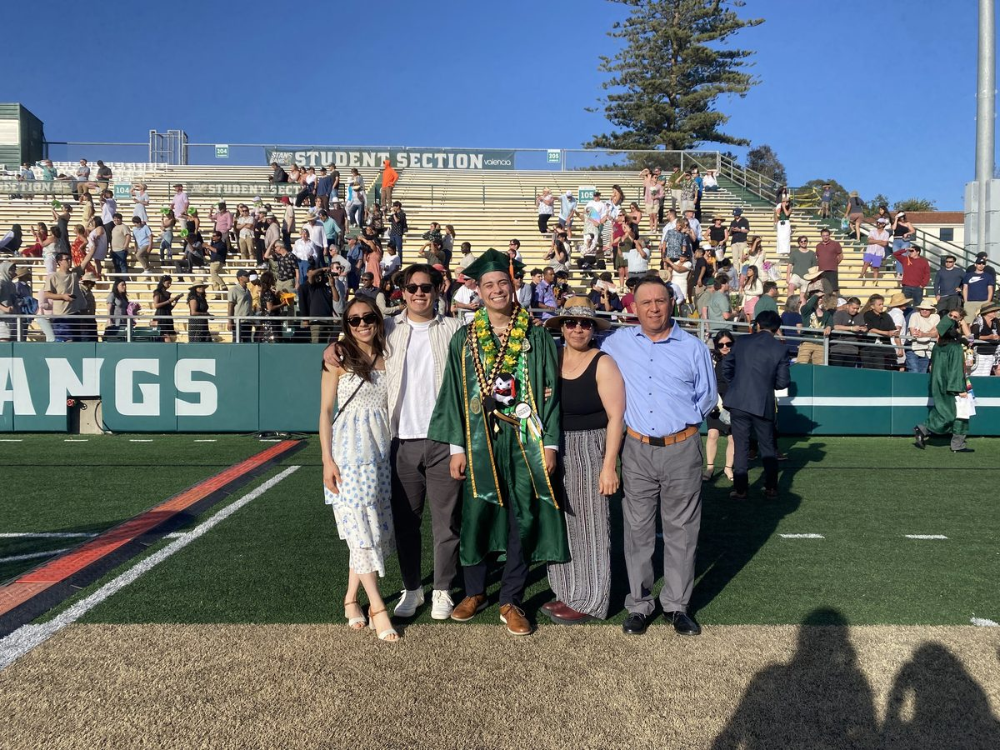
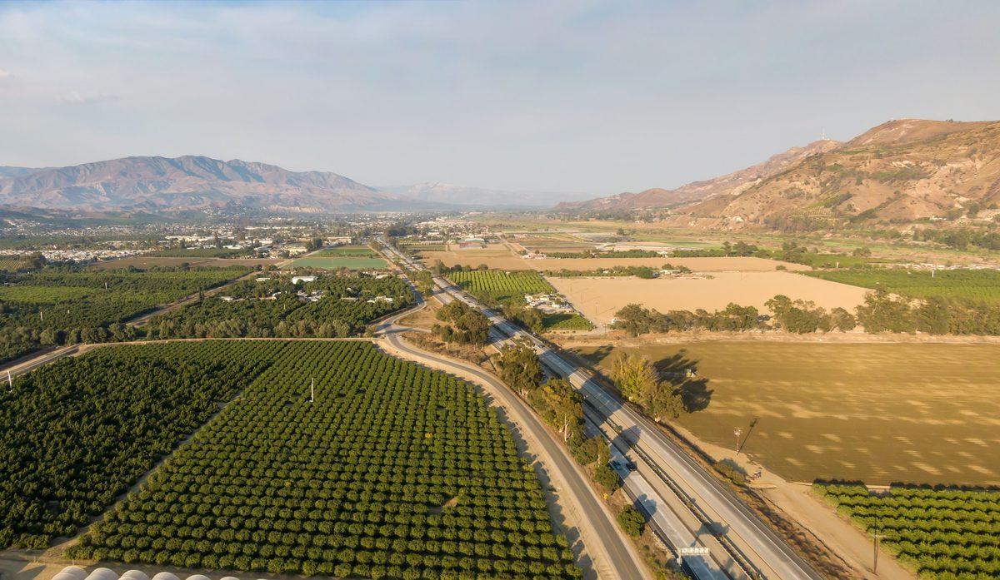
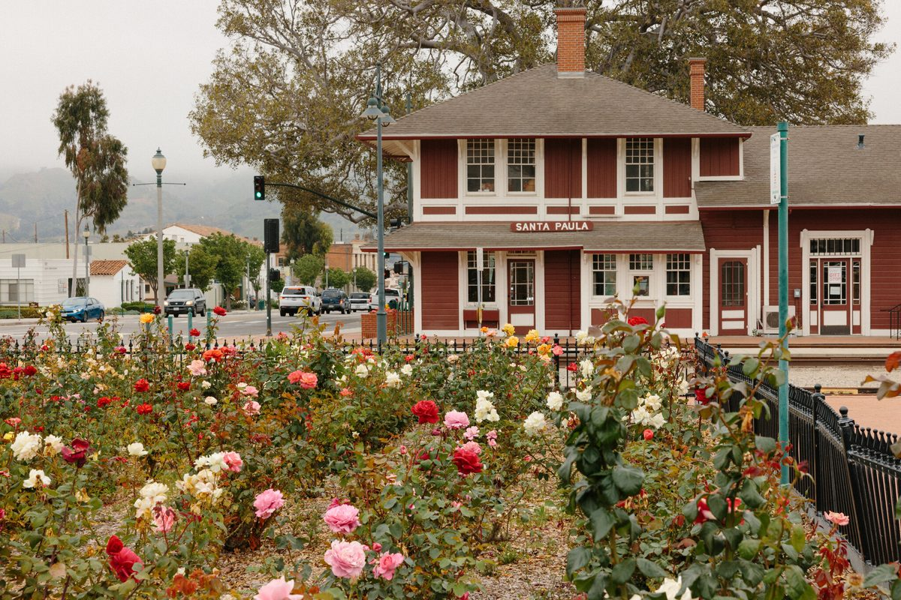

<style>
:root {
  --fs-title: 1rem;
  --fs-body:  0.95rem;
  --fs-small: 0.85rem;
  --c-title:  #1a1a1a;
  --c-body:   #444;
  --lh:       1.6;
}
.collage {display: grid; grid-template-columns: 1fr 1fr; grid-template-rows: 1fr 1fr; gap: 6px; height: 400px; border-radius: 10px; overflow: hidden; margin: 1.5em 0;}
.collage-main {grid-row: 1 / 3; overflow: hidden;}
.collage-side {overflow: hidden;}
.collage img {width: 100%; height: 100%; object-fit: cover; display: block;}
.timeline-wrapper {margin-top: 0.5em;}
.timeline-wrapper table {font-size: var(--fs-small); width: 100%; table-layout: fixed; line-height: var(--lh); color: var(--c-body);}
.timeline-wrapper td:nth-child(1),
.timeline-wrapper th:nth-child(1) {width: 20%;}
.timeline-wrapper td:nth-child(2),
.timeline-wrapper th:nth-child(2) {width: 80%;}
.timeline-wrapper td:nth-child(3),
.timeline-wrapper th:nth-child(3) {width: 0%;}
.timeline-wrapper th {text-align: center !important; color: var(--c-title); font-size: var(--fs-small);}
.timeline-wrapper td {text-align: left !important; vertical-align: middle !important; padding: 6px 10px; color: var(--c-body); font-size: var(--fs-small);}
</style>

Welcome to my About Me page, where you can learn more about who I am beyond the resume. This page covers my personal background, what shaped me growing up, and a timeline of the key roles and milestones that have brought me to where I am today.

## Personal Background

```{=html}
<div class="collage">
  <div class="collage-main">
    
  </div>
  <div class="collage-side">
    
  </div>
  <div class="collage-side">
    
  </div>
</div>
```

I was raised in Santa Paula, CA, a small agricultural city in Ventura County with a tight-knit Latino community, by two Mexican immigrant parents who worked day and night to put food on the table. From a young age, my siblings and I worked alongside them in their side ventures, including recycling, landscaping, installing water systems, welding, and painting. We were either in school or working, and while that was demanding, it was also grounding. My parents were strict, expected a great deal from us, and were deeply supportive all at once. School was always the top priority in our home, and that emphasis paid off. My siblings and I have all graduated from college and successfully entered a professional world that once excluded people like our parents.

As I have grown, I have tried to give back in the same spirit they gave to us. I took over managing their finances, helped map out their long-term goals, and started teaching them practical skills like basic technology and U.S. history as they prepare for their citizenship exam. When I noticed their credit card debt was becoming a burden, I developed a plan to help them pay it off and used it as an opportunity to teach them about credit and personal finance. As I continue to grow professionally, I hope to keep finding new ways to make sure they are never left behind.

## Professional Timeline

This timeline captures the key roles and milestones that have shaped my professional and academic development. For more details on each experience, please visit the [Experience](experience.html) page.

::: {.timeline-wrapper}
| Month & Year | Event | Location |
|---|---|---|
| 10/2020 | Began Economics B.A. at UCI | Irvine, CA |
| 03/2022–12/2023 | Basic Needs Advocate, UCI Basic Needs Center | Irvine, CA |
| 06/2022–08/2022 | Supply Chain Internship, Chipotle Mexican Grill | Newport Beach, CA |
| 06/2023–08/2023 | Education Department Internship, Reagan Presidential Library | Simi Valley, CA |
| 12/2023 | Completed Economics B.A. at UCI | Irvine, CA |
| 01/2024–08/2024 | Program Coordinator, UCI Basic Needs Center | Irvine, CA |
| 09/2024 | Enrolled in Quantitative Economics M.S., Cal Poly SLO | San Luis Obispo, CA |
| 10/2024–03/2025 | Returned to Santa Paula; Short-Term Employment | Santa Paula, CA |
| 04/2025–09/2025 | EAOP Program Coordinator, UCI Center for Educational Partnerships | Irvine, CA |
| 07/2025 | Began Business Analytics M.S. at UCI | Irvine, CA |
| 01/2026–06/2026 | Student Business Analyst, Anaheim Ducks Hockey Club | Irvine, CA |
| 06/2026 | Completed Business Analytics M.S. at UCI | Irvine, CA |
:::