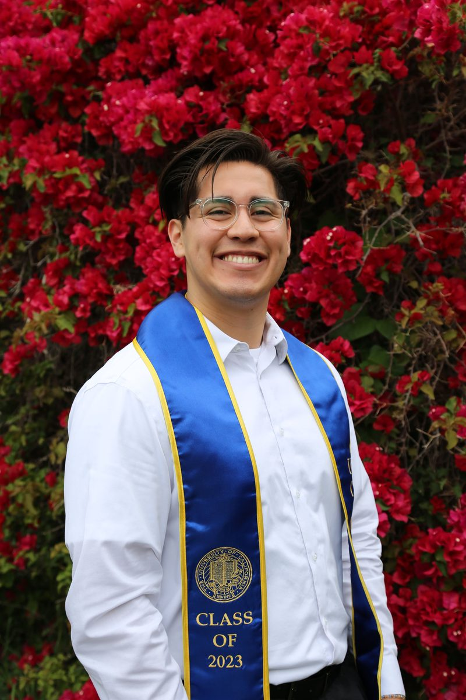

```{=html}
<style>
@import url('https://fonts.googleapis.com/css2?family=DM+Sans:ital,opsz,wght@0,9..40,300;0,9..40,400;0,9..40,500;1,9..40,400&display=swap');

*, *::before, *::after { box-sizing: border-box; margin: 0; padding: 0; }

body { font-family: 'DM Sans', sans-serif !important; background: #111 !important; color: #f5f5f5; font-size: 16px !important; }

#quarto-header, .navbar, #quarto-sidebar, #quarto-toc-toggle, #quarto-margin-sidebar, footer.footer { display: none !important; }

#quarto-content, .page-layout-custom, main.content { padding: 0 !important; margin: 0 !important; max-width: 100% !important; gap: 0 !important; }

.portfolio-shell { display: flex; height: 100vh; overflow: hidden; align-items: stretch; }

.sidebar { width: 250px; min-width: 250px; background: #111; border-right: 0.5px solid #1f1f1f; display: flex; flex-direction: column; padding: 3rem 1.6rem 1.75rem; position: sticky; top: 0; height: 100vh; overflow-y: auto; overflow-x: hidden; }

.sidebar-photo { width: 180px; height: 180px; border-radius: 50%; object-fit: cover; object-position: center 20%; border: 2px solid #2a2a2a; margin: 0 auto 2rem; display: block; }

.sidebar-name { font-size: 15px; font-weight: 500; color: #f5f5f5; margin-bottom: 3px; line-height: 1.3; }

.sidebar-credential { font-size: 14px; color: #60a5fa; letter-spacing: 0.2px; margin-bottom: 2px; }

.sidebar-avail { font-size: 14px; color: #f5f5f5; margin-bottom: 2px; }

.sidebar-grad { font-size: 14px; color: #f5f5f5; margin-bottom: 2rem; }

.sidebar-nav { display: flex; flex-direction: column; gap: 2px; }

.sidebar-nav a { display: flex; align-items: center; gap: 9px; padding: 7px 10px; border-radius: 6px; text-decoration: none !important; font-size: 14px; color: #f5f5f5; transition: color 0.15s, background 0.15s; }

.sidebar-nav a:hover { background: #1a1a1a; text-decoration: none !important; }

.sidebar-nav a.active { background: #1e3a5f; }

.nav-pip { width: 3px; min-width: 3px; height: 14px; border-radius: 2px; background: transparent; }

.sidebar-nav a.active .nav-pip { background: #60a5fa; }

.sidebar-rule { border: none; border-top: 0.5px solid #2a2a2a; margin: 1.6rem 0 1.2rem; }

.sidebar-links { display: flex; flex-direction: column; gap: 7px; margin-top: 0; }

.sidebar-links a { font-size: 14px; text-decoration: none !important; color: #f5f5f5; transition: color 0.15s; }

.sidebar-links a:hover { color: #aaaaaa; }

.main-content { flex: 1; background: #ffffff; padding: 2.75rem 2.75rem 3rem; min-height: 100vh; max-height: 100vh; overflow-y: auto; color: #111; }

.headline { font-size: 31px !important; font-weight: 500; color: #111; line-height: 1.2; margin-bottom: 0.3rem; letter-spacing: -0.3px; }

.rule-bold { border: none; border-top: 1.5px solid #111; margin: 0 0 1.5rem; }

.section-label { font-size: 14px !important; font-weight: 600; color: #111; letter-spacing: 0.8px; text-transform: uppercase; margin-bottom: 1rem; }

.body-text { font-size: 16px !important; color: #444; line-height: 1.5; margin-bottom: 1.25rem; }

.collage { display: grid; grid-template-columns: 1fr 1fr; gap: 6px; height: 380px; border-radius: 14px; overflow: hidden; margin: 2rem 0 2rem; }

.collage img { width: 100%; height: 100%; object-fit: cover; display: block; }

.timeline-wrapper { margin-top: 0.5rem; }

.timeline-wrapper table { font-size: 14px !important; width: 100%; table-layout: fixed; line-height: 1.5; color: #444; border-collapse: collapse; }

.timeline-wrapper td:nth-child(1), .timeline-wrapper th:nth-child(1) { width: 22%; }
.timeline-wrapper td:nth-child(2), .timeline-wrapper th:nth-child(2) { width: 55%; }
.timeline-wrapper td:nth-child(3), .timeline-wrapper th:nth-child(3) { width: 23%; }

.timeline-wrapper th { text-align: left !important; color: #60a5fa; font-size: 14px !important; font-weight: 700; letter-spacing: 0.8px; text-transform: uppercase; padding: 11px 8px; border-bottom: 1px solid #e8e8e8; }

.timeline-wrapper table { font-size: 14px !important; width: 100%; table-layout: fixed; line-height: 1.5; color: #444; border-collapse: collapse; }

.timeline-wrapper table tbody tr { background-color: transparent !important; }

.timeline-wrapper table tbody tr:nth-child(odd), .timeline-wrapper table tbody tr:nth-child(even) { background-color: transparent !important; }

.section-block { margin-bottom: 2.5rem; }
</style>

<div class="portfolio-shell">

  <aside class="sidebar">
    
    <div class="sidebar-name">Allan Almaraz</div>
    <div class="sidebar-credential">MSBA · UC Irvine</div>
    <div class="sidebar-avail">Available June 2026</div>
    <div class="sidebar-grad">Graduating August 2026</div>

    <nav class="sidebar-nav">
      <a href="index.html">
        <span class="nav-pip"></span>Home
      </a>
      <a href="about.html" class="active">
        <span class="nav-pip"></span>About Me
      </a>
      <a href="experience.html">
        <span class="nav-pip"></span>Experience
      </a>
      <a href="projects.html">
        <span class="nav-pip"></span>Projects
      </a>
    </nav>

    <hr class="sidebar-rule">

    <div class="sidebar-links">
      <a href="https://linkedin.com/in/allanalmaraz/" target="_blank">LinkedIn →</a>
      <a href="files/resume_analytics.pdf" target="_blank">Analytics Resume →</a>
      <a href="files/resume_highered.pdf" target="_blank">Higher Ed Resume →</a>
    </div>
  </aside>

  <main class="main-content">

    <div class="headline">About Me</div>

    <p class="body-text" style="margin-top: 1.75rem;">Welcome to my About Me page, where you can learn more about who I am beyond the resume. This page covers my personal background, what shaped me growing up, and a timeline of the key roles and milestones that have brought me to where I am today.</p>

    <hr class="rule-bold">

    <div class="section-block">
      <div class="section-label">Personal Background</div>

      <p class="body-text">I was raised in Santa Paula, CA, a small agricultural city in Ventura County with a tight-knit Latino community, by two Mexican immigrant parents who worked day and night to put food on the table. From a young age, my siblings and I worked alongside them in their side ventures, including recycling, landscaping, installing water systems, welding, and painting. We were either in school or working, and while that was demanding, it was also grounding. My parents were strict, expected a great deal from us, and were deeply supportive all at once. School was always the top priority in our home, and that emphasis paid off. My siblings and I have all graduated from college and successfully entered a professional world that once excluded people like our parents.</p>

      <div class="collage">
        
        
      </div>

      <p class="body-text">As I have grown, I have tried to give back in the same spirit they gave to us. I took over managing their finances, helped map out their long-term goals, and started teaching them practical skills like basic technology and U.S. history as they prepare for their citizenship exam. When I noticed their credit card debt was becoming a burden, I developed a plan to help them pay it off and used it as an opportunity to teach them about credit and personal finance. As I continue to grow professionally, I hope to keep finding new ways to make sure they are never left behind.</p>
    </div>

    <hr class="rule-bold">

    <div class="section-block">
      <div class="section-label">Professional Timeline</div>

      <p class="body-text">This timeline captures the key roles and milestones that have shaped my professional and academic development. For more details on each experience, visit the <a href="experience.html" style="color: #60a5fa; text-decoration: none; font-weight: 700;">Experience</a> page.</p>

      <div class="timeline-wrapper">
        <table>
          <thead>
            <tr><th>Month &amp; Year</th><th>Event</th><th>Location</th></tr>
          </thead>
          <tbody>
            <tr><td>10/2020</td><td>Began Economics B.A. at UCI</td><td>Irvine, CA</td></tr>
            <tr><td>03/2022-12/2023</td><td>Basic Needs Advocate, UCI Basic Needs Center</td><td>Irvine, CA</td></tr>
            <tr><td>06/2022-08/2022</td><td>Supply Chain Internship, Chipotle Mexican Grill</td><td>Newport Beach, CA</td></tr>
            <tr><td>06/2023-08/2023</td><td>Education Department Internship, Reagan Presidential Library</td><td>Simi Valley, CA</td></tr>
            <tr><td>12/2023</td><td>Completed Economics B.A. at UCI</td><td>Irvine, CA</td></tr>
            <tr><td>01/2024-08/2024</td><td>Program Coordinator, UCI Basic Needs Center</td><td>Irvine, CA</td></tr>
            <tr><td>09/2024</td><td>Enrolled in Quantitative Economics M.S., Cal Poly SLO</td><td>San Luis Obispo, CA</td></tr>
            <tr><td>10/2024-03/2025</td><td>Returned to Santa Paula; Short-Term Employment</td><td>Santa Paula, CA</td></tr>
            <tr><td>04/2025-09/2025</td><td>EAOP Program Coordinator, UCI Center for Educational Partnerships</td><td>Irvine, CA</td></tr>
            <tr><td>07/2025</td><td>Began Business Analytics M.S. at UCI</td><td>Irvine, CA</td></tr>
            <tr><td>01/2026-06/2026</td><td>Student Business Analyst, Anaheim Ducks Hockey Club</td><td>Irvine, CA</td></tr>
            <tr><td>08/2026</td><td>Completed Business Analytics M.S. at UCI</td><td>Irvine, CA</td></tr>
          </tbody>
        </table>
      </div>
    </div>

  </main>
</div>
```