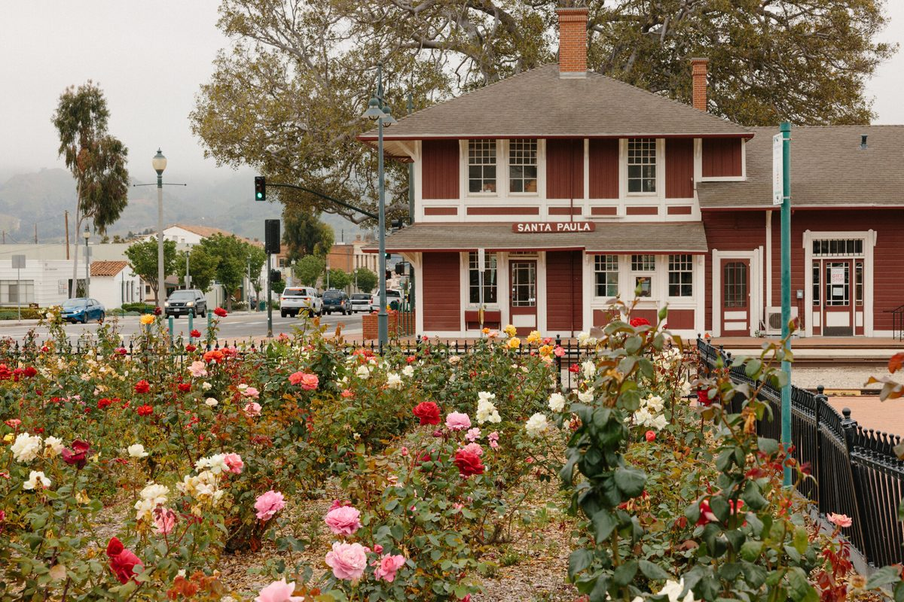
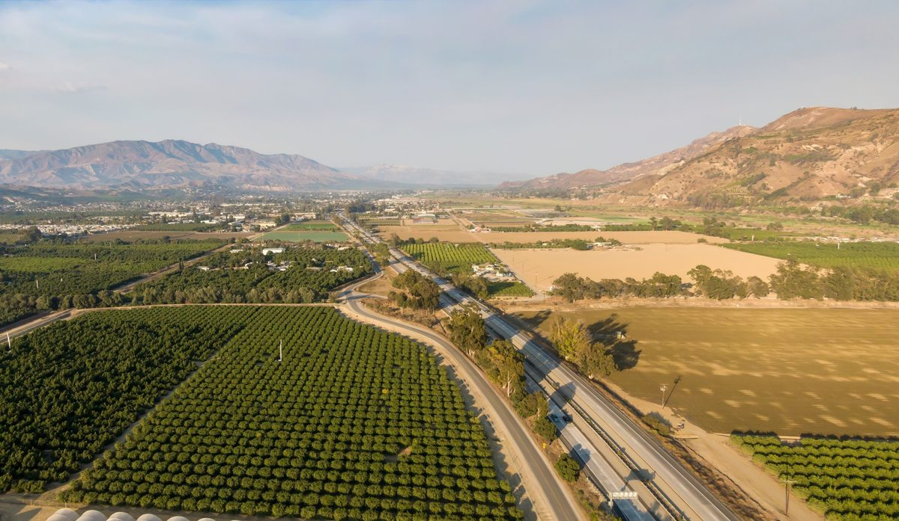

```{=html}
<style>
@import url('https://fonts.googleapis.com/css2?family=DM+Sans:ital,opsz,wght@0,9..40,300;0,9..40,400;0,9..40,500;1,9..40,400&display=swap');

*, *::before, *::after { box-sizing: border-box; margin: 0; padding: 0; }

body {
  font-family: 'DM Sans', sans-serif !important;
  background: #111 !important;
  color: #f5f5f5;
  font-size: 16px !important;
}

#quarto-header,
.navbar,
#quarto-sidebar,
#quarto-toc-toggle,
#quarto-margin-sidebar,
footer.footer {
  display: none !important;
}

#quarto-content,
.page-layout-custom,
main.content {
  padding: 0 !important;
  margin: 0 !important;
  max-width: 100% !important;
  gap: 0 !important;
}

.portfolio-shell { display: flex; height: 100vh; overflow: hidden; align-items: stretch; }

.sidebar {
  width: 250px;
  min-width: 250px;
  background: #111;
  border-right: 0.5px solid #1f1f1f;
  display: flex;
  flex-direction: column;
  padding: 3rem 1.6rem 1.75rem;
  position: sticky;
  top: 0;
  height: 100vh;
  overflow-y: auto;
}

.sidebar-photo { width: 180px; height: 180px; border-radius: 50%; object-fit: cover; object-position: center 20%; border: 2px solid #2a2a2a; margin: 0 auto 2rem; display: block; }

.sidebar-name {
  font-size: 17px;
  font-weight: 500;
  color: #f5f5f5;
  margin-bottom: 3px;
  line-height: 1.3;
}

.sidebar-credential {
  font-size: 17px;
  color: #f5f5f5;
  letter-spacing: 0.2px;
  margin-bottom: 2px;
}

.sidebar-nav {
  display: flex;
  flex-direction: column;
  gap: 2px;
}

.mobile-page-title { display: none; }

.sidebar-nav a {
  display: flex;
  align-items: center;
  gap: 9px;
  padding: 7px 10px;
  border-radius: 6px;
  text-decoration: none !important;
  font-size: 16px;
  color: #f5f5f5;
  transition: color 0.15s, background 0.15s;
}

.sidebar-nav a:hover {
  background: #1a1a1a;
  text-decoration: none !important;
}

.sidebar-nav a.active {
  background: #1e3a5f;
}

.nav-pip {
  width: 3px;
  min-width: 3px;
  height: 14px;
  border-radius: 2px;
  background: transparent;
}

.sidebar-nav a.active .nav-pip {
  background: #60a5fa;
}

.sidebar-rule {
  border: none;
  border-top: 0.5px solid #2a2a2a;
  margin: 1.6rem 0 1.2rem;
}

.sidebar-links-label {
  font-size: 16px !important;
  font-weight: 700;
  color: #60a5fa;
  letter-spacing: 0.8px;
  text-transform: uppercase;
  margin-bottom: 8px;
}

.sidebar-nav-label {
  font-size: 16px !important;
  font-weight: 700;
  color: #60a5fa;
  letter-spacing: 0.8px;
  text-transform: uppercase;
  margin-top: 1.5rem;
  margin-bottom: 8px;
}

.sidebar-links {
  display: flex;
  flex-direction: column;
  gap: 7px;
  margin-top: 0;
  padding-left: 22px;
}

.sidebar-links a {
  font-size: 16px;
  text-decoration: none !important;
  color: #f5f5f5;
  transition: color 0.15s;
}

.sidebar-links a:hover { color: #aaaaaa; }

.main-content { flex: 1; background: #ffffff; padding: 2.75rem 2.75rem 3rem; min-height: 100vh; max-height: 100vh; overflow-y: auto; color: #111; }

.content-inner { max-width: 900px; }

.headline { font-size: 31px !important; font-weight: 500; color: #111; line-height: 1.2; margin-bottom: 0.3rem; letter-spacing: -0.3px; }

.rule-bold { border: none; border-top: 1.5px solid #111; margin: 0 0 1.5rem; }

.section-label { font-size: 16px !important; font-weight: 600; color: #111; letter-spacing: 0.8px; text-transform: uppercase; margin-bottom: 1rem; }

.body-text { font-size: 16px !important; color: #444; line-height: 1.5; margin-bottom: 1.25rem; }

.collage { display: grid; grid-template-columns: 1fr 1fr; gap: 6px; height: 380px; border-radius: 14px; overflow: hidden; margin: 2rem 0 2rem; }

.collage img { width: 100%; height: 100%; object-fit: cover; display: block; }

.section-block { margin-bottom: 2.5rem; }

.menu-toggle { display: none; }
.mobile-footer { display: none; }

@media (max-width: 768px) {
  .portfolio-shell { flex-direction: column; height: auto; }

  .sidebar {
    width: 100%; min-width: 0; height: auto;
    position: fixed; top: 0; left: 0; right: 0; z-index: 100;
    flex-direction: row; align-items: center; justify-content: space-between;
    padding: 10px 16px; overflow: visible;
  }

  .sidebar-photo { width: 44px; height: 44px; margin: 0 12px 0 0; border-width: 1px; }
  .sidebar-credential { display: none; }
  .sidebar-name { display: none; }
  .mobile-page-title { display: block; font-size: 17px; font-weight: 500; color: #f5f5f5; line-height: 1; }

  .menu-toggle {
    display: flex; align-items: center; justify-content: center;
    width: 32px; height: 32px; background: none; border: none;
    color: #f5f5f5; font-size: 20px; line-height: 1; padding: 0; cursor: pointer;
  }

  .mobile-dropdown {
    display: none; flex-direction: column;
    position: absolute; top: 100%; left: 0; right: 0;
    background: #111; padding: 6px 16px 14px; z-index: 50;
    border-top: 0.5px solid #1f1f1f;
  }

  .sidebar.menu-open .mobile-dropdown { display: flex; }

  .sidebar-rule { border-top: 0.5px solid #2a2a2a; margin: 24px 0 2px; }
  .sidebar-links-label { margin-bottom: 8px; }
  .sidebar-links { display: flex; flex-direction: column; gap: 10px; margin-top: 0; }

  .main-content { height: auto; max-height: none; padding: 76px 1.25rem 2rem; }
  .headline { font-size: 24px !important; }

  .collage { grid-template-columns: 1fr; height: auto; }
  .collage img { height: 220px; }

  .mobile-footer {
    display: block; margin-top: 2.5rem; padding-top: 1.25rem;
    border-top: 0.5px solid #e8e8e8; text-align: center;
  }
  .mobile-footer .footer-links { display: flex; justify-content: center; gap: 16px; margin-bottom: 8px; }
  .mobile-footer .footer-links a { font-size: 15px !important; color: #111; text-decoration: none !important; }
  .mobile-footer .footer-copyright { font-size: 12px !important; color: #888; }
}
</style>

<div class="portfolio-shell">

  <aside class="sidebar">
    
    <div class="sidebar-name">Allan Almaraz</div>
    <div class="mobile-page-title">About Me</div>
    <div class="sidebar-credential">Business Analytics M.S.</div>

    <button class="menu-toggle" aria-label="Toggle menu" onclick="document.querySelector('.sidebar').classList.toggle('menu-open')">☰</button>

    <div class="mobile-dropdown">
      <div class="sidebar-nav-label">Page Navigation</div>
      <nav class="sidebar-nav">
        <a href="index.html">
          <span class="nav-pip"></span>Home
        </a>
        <a href="about.html" class="active">
          <span class="nav-pip"></span>About Me
        </a>
        <a href="experience.html">
          <span class="nav-pip"></span>Experience
        </a>
        <a href="projects.html">
          <span class="nav-pip"></span>Projects
        </a>
      </nav>

      <hr class="sidebar-rule">

      <div class="sidebar-links-label">Helpful Links</div>
      <div class="sidebar-links">
        <a href="https://linkedin.com/in/allanalmaraz/" target="_blank">LinkedIn</a>
        <a href="files/resume.pdf" target="_blank">Resume</a>
      </div>
    </div>
  </aside>

  <main class="main-content">
    <div class="content-inner">

    <div class="headline">About Me</div>

    <p class="body-text" style="margin-top: 1.75rem;">Welcome to my About Me page, where you can learn more about who I am beyond the resume. This page covers my personal background, the community that raised me, and the values instilled early on that continue to shape how I approach my work today.</p>

    <hr class="rule-bold">

    <div class="section-block">
      <div class="section-label">Personal Background</div>

      <p class="body-text">I was raised in Santa Paula, CA, a small agricultural city in Ventura County with a tight-knit Latino community, by two Mexican immigrant parents who worked day and night to put food on the table. From a young age, my siblings and I worked alongside them in their side ventures, including recycling, landscaping, installing water systems, welding, and painting. We were either in school or working, and while that was demanding, it was also grounding. My parents were strict, expected a great deal from us, and were deeply supportive all at once. School was always the top priority in our home, and that emphasis paid off. My siblings and I have all graduated from college and successfully entered a professional world that once excluded people like our parents.</p>

      <div class="collage">
        
        
      </div>

      <p class="body-text">As I have grown, I have tried to give back in the same spirit they gave to us. I took over managing their finances, helped map out their long-term goals, and started teaching them practical skills like basic technology and U.S. history as they prepare for their citizenship exam. When I noticed their credit card debt was becoming a burden, I developed a plan to help them pay it off and used it as an opportunity to teach them about credit and personal finance. As I continue to grow professionally, I hope to keep finding new ways to make sure they are never left behind.</p>
    </div>

    <footer class="mobile-footer">
      <div class="footer-links">
        <a href="https://linkedin.com/in/allanalmaraz/" target="_blank">LinkedIn</a>
        <a href="mailto:almaraz1050@gmail.com">Email</a>
      </div>
      <div class="footer-copyright">© 2026 Allan Almaraz</div>
    </footer>

    </div>
  </main>
</div>
```
